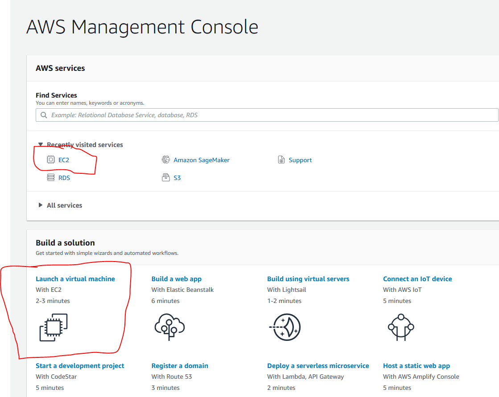
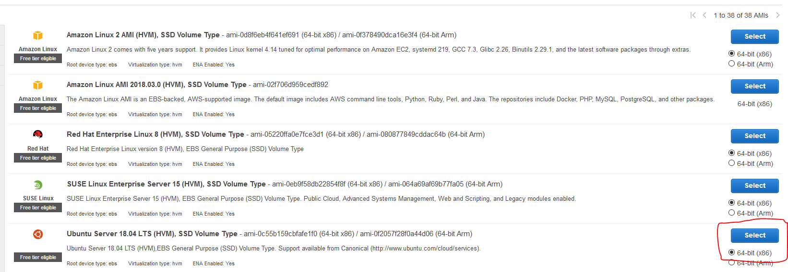
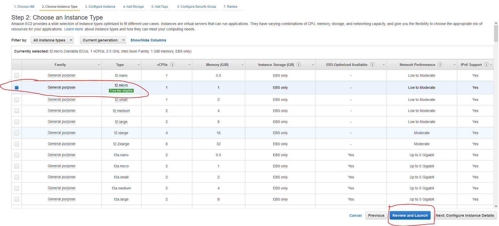
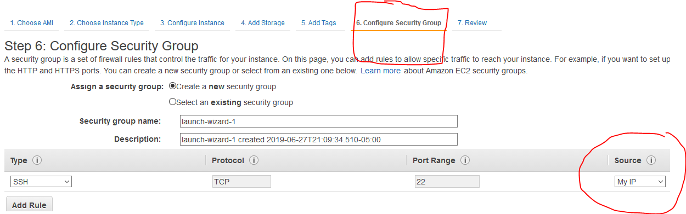
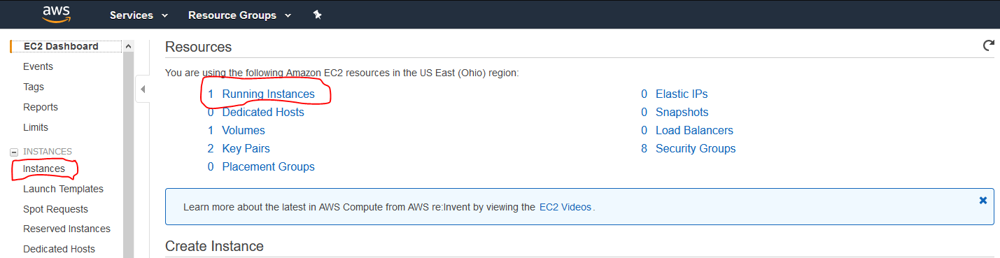
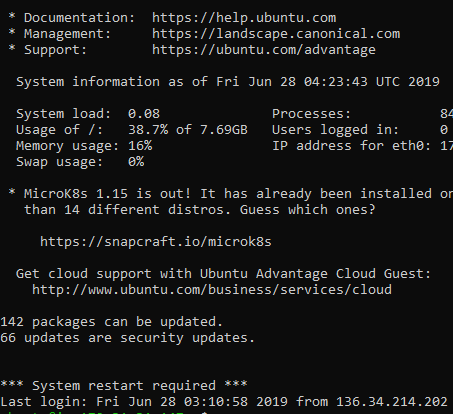

# AWS EC2

## Setting up your instance

#### Step 1. Find EC2 on your AWS console



#### Step 2. Select an Ubuntu instance



#### Step 3. Select a general purpose t2.micro

The t2.micro should be the default. It should also be the free tier.



#### Step 4. Whitelist your IP address.

AWS should stop you from launching your instance before you set up your ec2 instance. Clicking on the **Source** drop down should allow you to whitelist your own IP by selecting My IP. You can also fill in custom IP's if you need to add others. 



### Step 5. Download a new or existing pair of ssh keys.

You can create a new pair of ssh keys or associate your instance with an existing pair of keys if you have some already.



## Connecting to Your Instance

### Optional Step. Move your new ssh key into your project directory

This step isn't necessary but I did it so I could stay organized and make the upcoming commands easier. 

### Step 7. Find your IPv4 address

#### Find your instance from the EC2 dashboard.


Go to your instance dashboard by clicking the link on Running Instances or Instances.  


#### Find your IPv4 Address

  
‌  
Your IPv4 address should be of the form xxx.xxx.xxx.xxx or 127.0.0.0. Max of 3 digits between each each dot, sometimes its just 1 or two digits.  


### Step 8. Use ssh to connect to your instance

Now you have your IPv4 address and know where your ssh\_keys are saved. Run the command below.

```bash
sudo ssh - i path/to/ssh/key.pem ubuntu@xxx.xxx.xxx.xxx
```

If you are successful, your terminal should match the below picture



### Step 9. Set up your project

  
‌  
this tutorial assumes you have used github or a similar product for version control. So you can simply run git clone your\_repo.git to create your new folder.  
‌  


### Step 10. Set up your environment

  
‌  
If you have used a pipenv environment in development of your project, you can just follow the guide in the chapter Starting with Pipenv.

