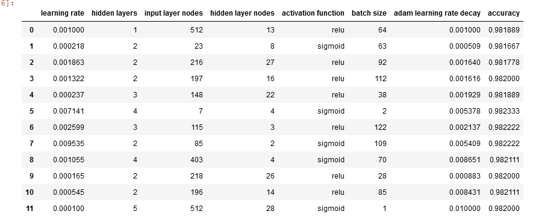

# Parameter & HyperParameter Tuning with Bayesian Optimization

[**Link to repo with .ipynb notebook for this code**](https://github.com/crawftv/Skopt-hyperparameter-tutorial)**.**  
[**Link to a Google Colab notebook with this code.**](https://colab.research.google.com/drive/1tYXmorCchEtsB12830lo6AhG-4HRZz4q)

This guide will walk the reader through using two scikit-optimize functions to find the optimal model architecture and tune hyperparameters for a “vanilla” neural network. This article uses explores Gaussian Processes and Gradient Boosted Regression. Fortunately we don’t need a deep understanding of these. We just need to know that the search function adjusts based on how each change in the model performs.

Fortunately you don’t need to understand this equation to implement the Gaussian search.

As is tradition, this tutorial will use the MNIST handwritten digits data set. Let’s start with loading and transforming the data.

### **\(Making the baseline is optional, if you are familiar with this kind of work feel free to skip it and advance to the second part of the guide.\)**





We get an accuracy of **92.83%** for our naive model.

## **Gaussian Process**

Now Lets get to the Fun Part, HyperParameter Tuning.

> \(If you followed along with the first part of the assignment, I found this part works best if you restart your kernel and skip the code for the baseline NN.\)

We start by importing functions from [sci-kit optimize](https://scikit-optimize.github.io/) and Keras.



Creating our search parameters. “dim\_” short for dimension. Its just a way to label our parameters. We can search across nearly every parameter in a Keras model. This code focuses on:

* Number of Layers
* Number of Nodes per layer
* Learning Rate & Weight Decay for the Adam Optimizer
* activation functions
* batch size

The name feature allows us to use the decorator later. We must also establish default parameters.



This function will create all the models that will be tested. Importing the Adam optimizer allows us to adjust its learning rate and decay.



This fitness function looks like a lot, but most of it is just the parameters. We use create\_model to create our model, fit the model, print the accuracy, and delete the model.



 Running these two lines of code can solve a lot of the Tensorflow errors that seem impossible to read. They clear much of the information tensor flow has stored. **Run this code before every hyperparameter or anything that makes a new Keras/Tensorflow model.**



Finally, we can start our search. This example changes many of the default parameters to give an idea of how much is modifiable. A later code snippet will use simpler parameters. \(And funny enough, your hyperparameter tuner will its own parameters tuned.\) Below is the function that performs the bayesian optimization by way of Gaussian Processes. n\_calls=12 because that is the smallest possible amount to get this function to run. You might need to increase this.



 Lets see how our search performed. gp\_result.fun returns our best accuracy, which was 97.21%. **What was the range of our search?**



One last thing for our Gaussian Process model. We need to try it on the test data. So we use our create\_model function to recreate our best model. Then we retrain and evaluate. Our final test accuracy is… **98.09%**.



## **Gradient Boosted Regression Trees**



This function uses Gradient Boosting Regression Trees to find the ideal model parameters. Make sure to clear the session and graph before running this. We only need to change this function: replacing gp\_minimze with gbrt\_minimze.

The final result on the test results was **98.13%.**

### **Examining our final models**

We get two very different models but both have great results. Notice the difference in the number of trainable parameters.

### **Gaussian Process Model**

```text
_________________________________________________________________
Layer (type)                 Output Shape              Param #   
=================================================================
dense_3 (Dense)              (None, 7)                 5495      
_________________________________________________________________
layer_dense_1 (Dense)        (None, 4)                 32        
_________________________________________________________________
layer_dense_2 (Dense)        (None, 4)                 20        
_________________________________________________________________
layer_dense_3 (Dense)        (None, 4)                 20        
_________________________________________________________________
layer_dense_4 (Dense)        (None, 4)                 20        
_________________________________________________________________
dense_4 (Dense)              (None, 10)                50        
=================================================================
Total params: 5,637
Trainable params: 5,637
Non-trainable params: 0
_________________________________________________________________
```

### **Gradient Boosted Model**

```text
_________________________________________________________________
Layer (type)                 Output Shape              Param #   
=================================================================
dense_5 (Dense)              (None, 395)               310075    
_________________________________________________________________
layer_dense_1 (Dense)        (None, 16)                6336      
_________________________________________________________________
dense_6 (Dense)              (None, 10)                170       
=================================================================
Total params: 316,581
Trainable params: 316,581
Non-trainable params: 0
```

[Much thanks to this blog post for providing a framework for this code.](https://github.com/Hvass-Labs/TensorFlow-Tutorials/blob/master/19_Hyper-Parameters.ipynb)

\*\*\*\*

