# PostgreSQL AWS RDS

## What do the words above mean?

PostgreSQL: an industry standard relational database.

AWS: Amazon Web Service

RDS: Relational Database  Service

## Why AWS?

1. You probably have AWS credits burning a hole in your pocket. 
   1. If not, the free tier seems to be fairly generous compared to paid offerings
2. You pay for convenience most of the time. But the convenience is an illusion. The hardest and most intimidating part of working with AWS is signing up for services. Using the RDS is fairly easy to set up.
3. 
## Set up PostgreSQL on RDS

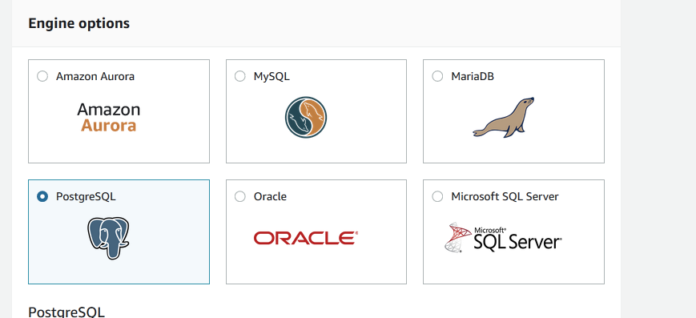

Make sure to choose PostgreSQL

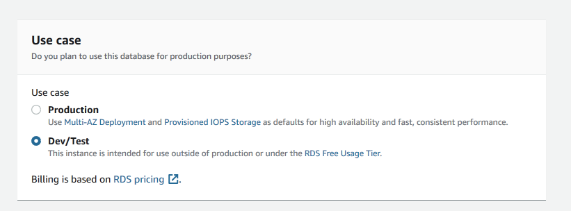

Make sure to use your free tier

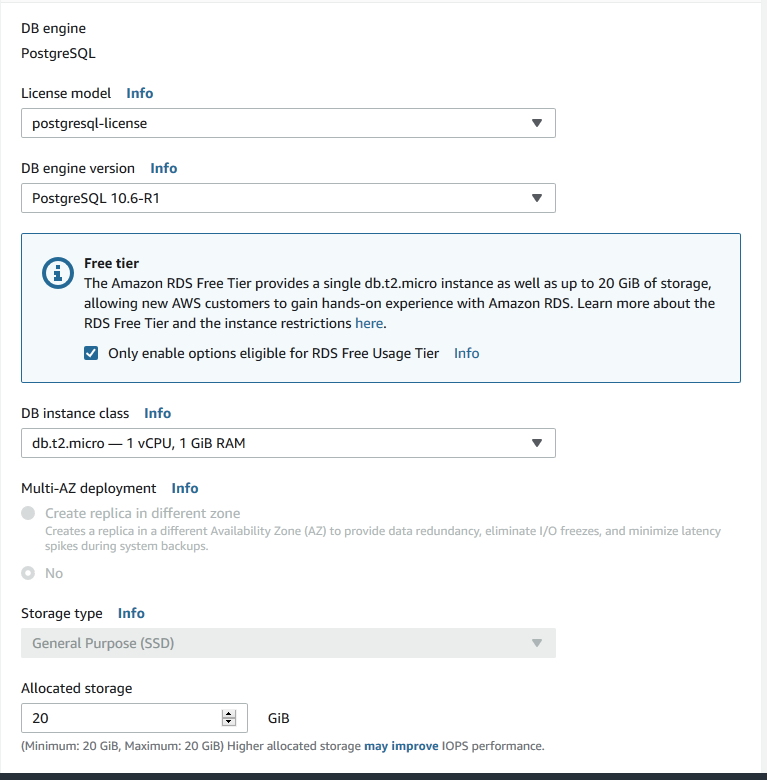

If your console give you the option to choose "only enable options eligible for RDS Free Usage Tier" use that. If not, the image shows the default settings for free tier.

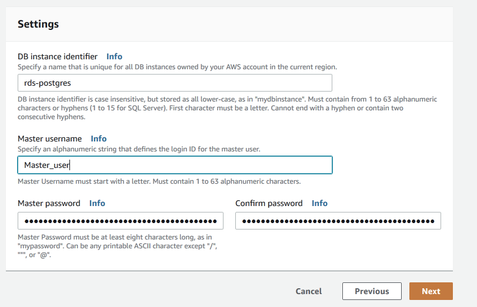

Give your database instance a name, username, and a password. Make sure you have access to these because we will use it later.

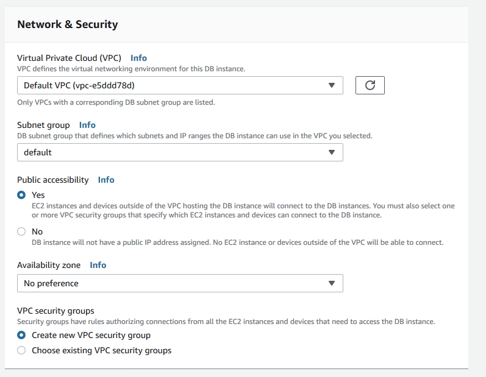

Default settings.

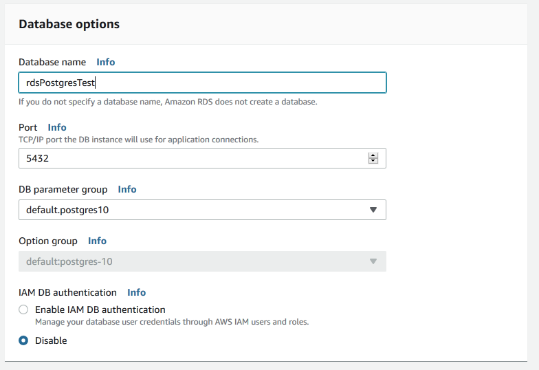

Give your database a name. Everything else is the default. The process in this book does not use IAM DB authentication.

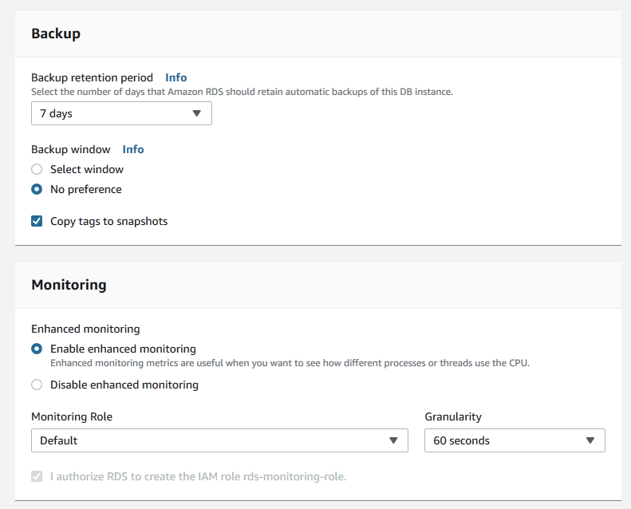

Defaults.

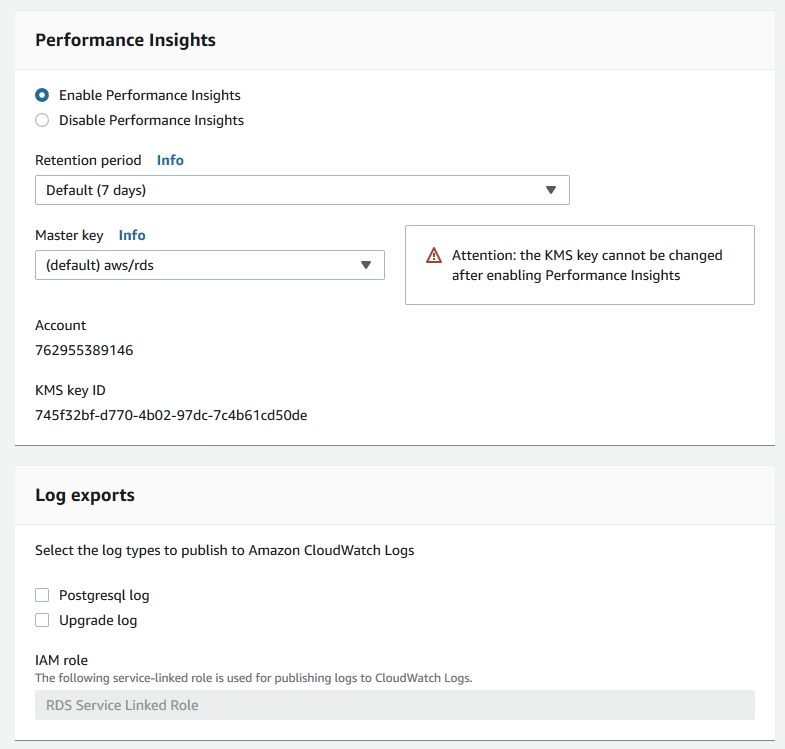

More Defaults

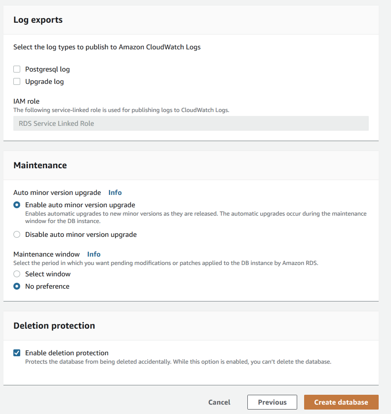

And finally more defaults. Although I did enable deletion protection. Better safe than sorry. You should be able disable this later if you need to delete the table.

After clicking "create database" it takes about 10 minutes for your database to be created. 

## Connecting to your database

### Set up your local environment 

Below is a basic little script for connecting to your new database. your PostgreSQL url is a combination of your database-username from above, database-password,  the endpoint, the port number \(usually 5432\), and the database-name



### Tips

* You should save the `AWS_DATABASE_URL` in a `.env` file.
* If you are using ubuntu, i find you need to install 

### Give your IP access to your to your RDS database

If you do not follow this step you will get an error message like this:  
`could not connect to server: Connection timed out (0x0000274C/10060) Is the server running on host "xxxxxxxxx" (-) and accepting TCP/IP connections on port 5432?`

click on the "rds-launch-wizard" in the **Security** section on your dashboard.

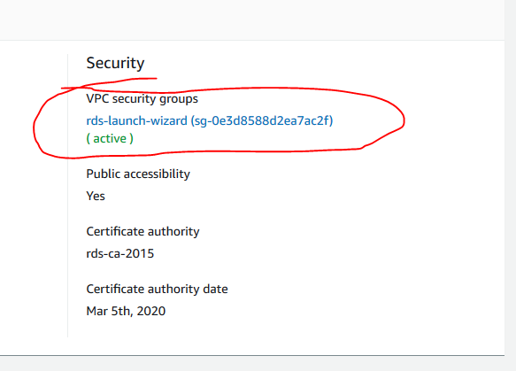

Look for the "edit inbound rules"

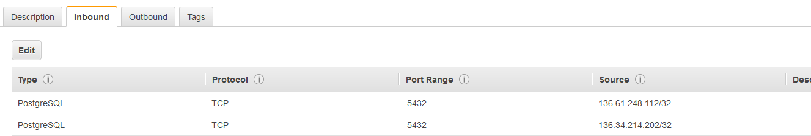

This is the window that pops up after clicking on the "Edit button". Click on "Add Rule".   
**Type** = ****PostgreSql.  
**Protocol** = TCP  
**Port Range** = 6432   
**Source:** You can select "My IP" for local work. If you need to connect from an app you can add it after selecting Custom.

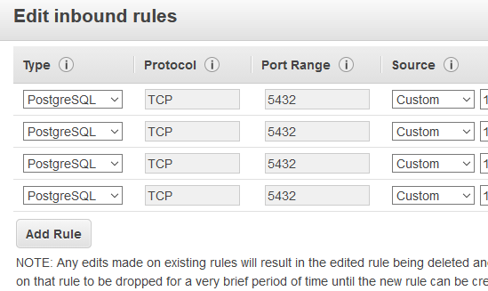

## Tips

* If you can't find your database on the console, before you freak out, make sure you are looking in the right region.

