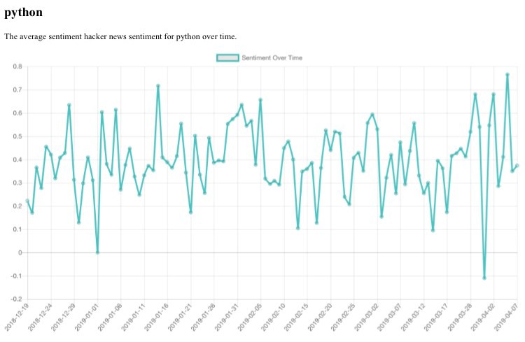

# JavaScript, Jinja & FlaskBlog Post

This article is guide for getting data from your python program to JavaScript inside of a Jinja HTML template . The solution is relatively simple, but until now there was not a good article explaining how to do it.

[Full GitHub repo is here.](https://github.com/crawftv/hn_app)  
[A Live version of the website is here.](https://hn-comments.herokuapp.com)

## **Step 1: Make sure to use the right Flask JSON module.**

The flask library has two libraries for making JSON objects. If you have used Flask as a back-end, you might have used `jsonify.` However this does not work quite right for our goal. Technically this code uses the standard library JSON module, but it still needs to be imported through flask.   
Turn the data you need on the front-end into a JSON object with `json.dumps()`.

All the highlights from the file are included below.



## **Step 2: Put JavaScript in your Jinja Template.**

Get the template ready for the JavaScript code by adding a special JavaScript block content and adding script tags. **Make sure to add the closings for each.**   
Outside of the JS block, create the element to contain the chart. The canvas element is specifically for graphics, so that’s what I used. It is important to note that width and height values in the canvas are ratios.   
Load the objects like you would with a normal Jinja template i.e. {{object}} , but add `| tojson` . To make everything run smoothly, you need to pass the object to the `JSON.parse()` function.   
This example repo uses code from the [charts.js library](https://www.chartjs.org/docs/latest/).



## **Step 3: Admire your work**

Being able to incorporate a little JavaScript into your Flask app makes it look 10 times better. By using only a few lines of JS, we created a responsive, interactive, and animated chart.

