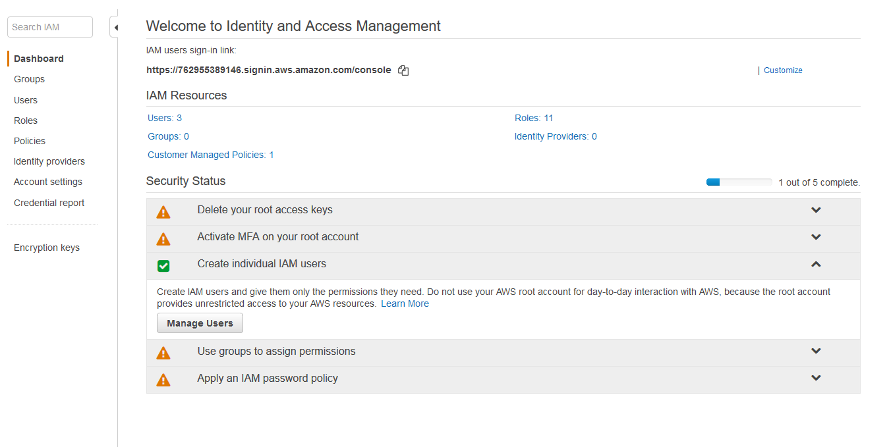
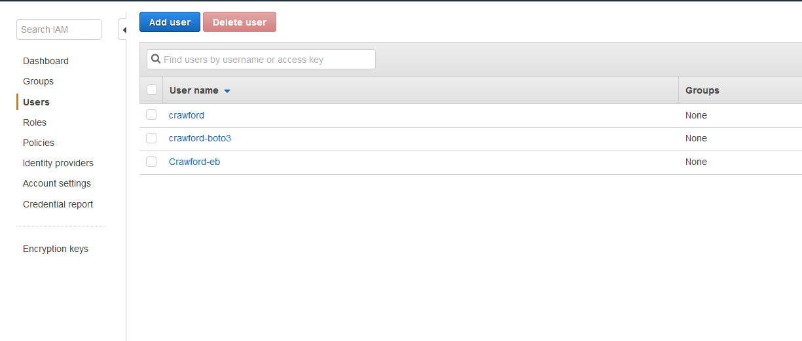
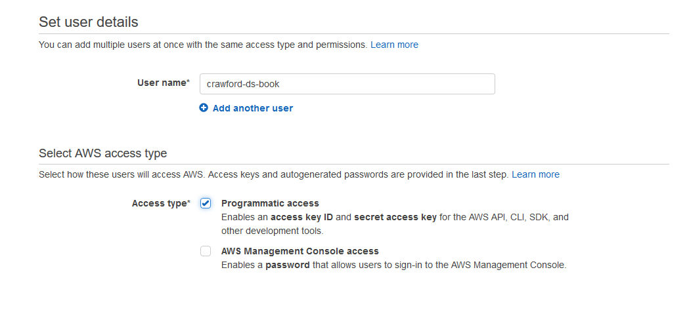
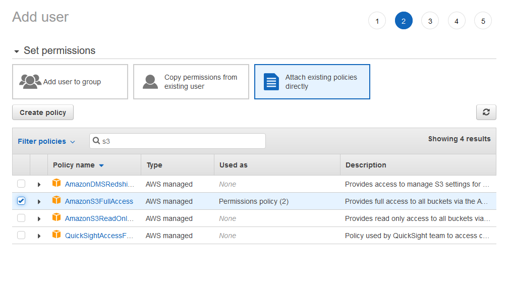
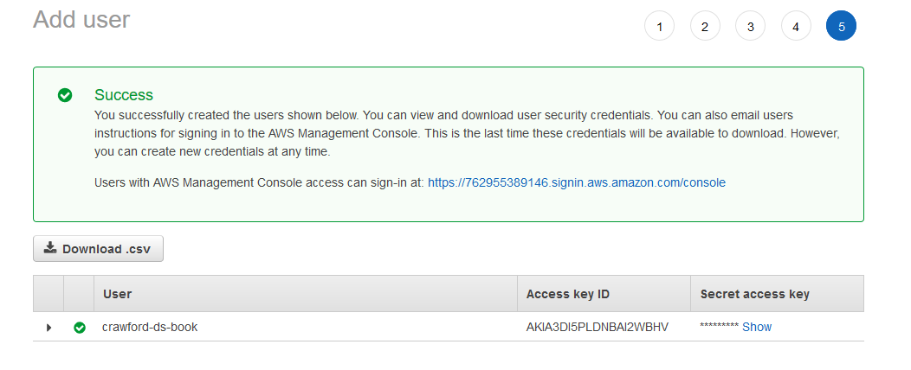
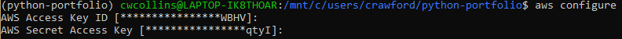

# nteract-papermill

## Setup

### If you plan on using aws.

`pip install papermill[s3]`  
`sudo apt-get update  
sudo apt-get install awscli  
pip3 install jupyter`

Without installing jupyter, you will get an error from papermill saying that there is no kernel. I tried installing miniconda for some sort of synergy but it did not work. These instructions are the best.  
Some guides mentioned doing papermill with a conda environment, but I could not make that work. Anaconda comes with over 700 packages, which is great for your own computer, but not a great idea for running code on a webserver. 

### Setting up AWS. 

Using AWS can be the most frustrating part of using the internet. The documentation is at best unclear, often what you see and what you are supposed to see are two different things, and you usually go around in circles reading documentation links. The instructions have everything you need to get papermill working with aws.

This is the first page you see when you go to the Amazaon IAM page. Click on the _Create individual IAM users_.  Then click on _Manage Users._ 

Click on _Add User_. 

Find a new name for yourself and give yourself programmatic access. We need to use the AWS CLI \(command line interface\) to take advantage of papermill. 

Under the _Attach existing policies directly_ tab, enter s3 in the search bar and add _Amazon S3FullAccess_.   
Click on through the review until you see the _Success_ screen. 

At this screen, you have the option to download your Access key ID and Secret access key as .csv file. You can only view these online while this window is open. So make sure to download these keys or save them somewhere you can trust. 

To finally get this stuff working type `aws configure` in your terminal. Enter your Access Key ID and Secret Access Key where appropriate. There are other prompts after those two such as default region. Set those up if you really need to, but since I am in the U.S. I am fine with the defaults.

## Running Papermill

#### Now that we have the setup ready, let's get papermill running. 

If you have a notebook you want to run you can use that, if not, you can use this [notebook.](https://github.com/crawftv/Miscellaneous/blob/master/papermill_aws_permissions_test.ipynb)   
The command to run my simple test is a one liner. Since I am in my the directory with my notebook the command is: `papermill papermill_aws_permissions_test.ipynb s3://python-portfolio/saved-notebooks/save.ipynb`

You can navigate to the folder you specified in the `s3` address. the command will make a folder for you, if you haven't made one in the S3 console. 

